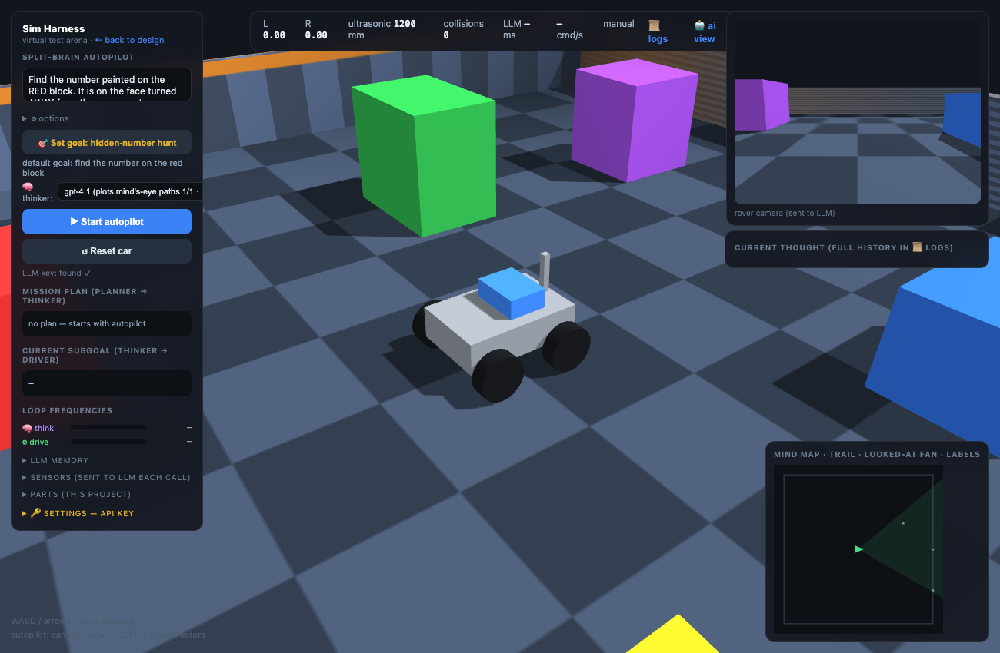

# OTA-VLA Lab 🤖

**An experiment in tuning an over-the-air LLM to act like a VLA (vision-language-action) model.**

Real VLA models — the neural nets that drive research robots — are trained end-to-end to turn camera frames into motor actions. This project asks a different question: **how far can you push ordinary cloud LLM APIs (GPT-4.1-class, over the air) toward the same job**, using nothing but prompt architecture, code-side scaffolding, and honest measurement?

The answer turned out to be: surprisingly far — if you're willing to learn, from logged evidence, exactly where language models end and control code must begin.



## What it is

A zero-dependency browser robotics simulator (pure Python stdlib server + Three.js) where a hierarchical LLM stack hunts for a hidden number painted on one face of one block in an arena:

- **Planner** (one call per mission) — breaks the mission into steps with machine-checkable success conditions, occlusion-aware ("explore until sighted", not "scan in place")
- **Thinker** (~0.3 Hz, vision) — perceives, labels, self-annotates the map, writes its own success checks, and commands the rover by **calling functions** from a fixed action library
- **Motion layer** (hardcoded, 60 Hz) — executes primitives (`move`, `turn`, `face`, `goto`, `scan`, `follow_waypoints` with per-point look/dwell, `mark`, `continue`…) with measured progress, tapered precision, and pre-flight path validation against the rover's own map
- **The mind's eye** — a live self-built map: tri-state occupancy (**never-seen / seen-free / obstacle** — walls cast real vision shadows), self-correcting landmarks (re-report, `forget`, phantom detection), POI notes, coverage fan — rendered back to the LLM as an image *and* an ASCII grid it plots waypoints on

**Three worlds** (map dropdown): an open test arena; a **house floor** with rooms, doorways, and furniture obstructions; and an **ambiguity mode** where every block is blue and the rover must discover multiplicity and verify candidates itself.

**Status: the arena mission has been won end-to-end** — located, approached, orbited, verified, answered correctly in 114s for $0.023 (see [`NOTABLE_MOMENTS.md`](NOTABLE_MOMENTS.md) #2). The house is the current frontier.

Everything the model believes is visible live: its scene narration (👁 observe / 🤔 assess / ➜ decide), its self-written memory, its map, its plan checklist, and every token and cent spent.

## Quickstart

Requirements: Python 3.9+, a modern browser, an OpenAI API key. No pip installs.

```bash
python3 server.py
# open http://127.0.0.1:8321/sim.html
```

1. Open **🔑 Settings** in the left panel and paste your OpenAI API key (stored in a local, gitignored `config.json`)
2. The default goal is already a hunt — press **▶ Start autopilot**
3. Watch it scan, label, plot, navigate, and (sometimes) read the answer

Typical cost: **$0.05–0.15 per 10-minute session** (gpt-4.1 thinker at ~$0.0003–0.0005/thought). A live token/cost meter runs in the UI. There's also a **Strategy Arena** (`/arena.html`) that runs 10 chambers with 10 different search strategies simultaneously, and a design view (`/`) with STL viewing and an OpenSCAD → STEP pipeline (optional; needs OpenSCAD/FreeCAD).

## What we learned (the short version)

The full engineering journal is in [`LAB_NOTES.md`](LAB_NOTES.md) — every feature, every failure, every measured number, in order. Highlights:

1. **LLMs do semantics; code does geometry, checking, and safety.** Every rule that lived only in prose was eventually ignored (confirmed ~6 separate times). Every capability became reliable the moment code measured its progress.
2. **"Long-horizon" tasks are usually missing-progress-variable tasks.** Orbiting a block was impossible until swept-angle became a number; then it was trivial.
3. **Models report bearings image-style (positive = right) regardless of what your prompt declares** — and consume your convention correctly at the same time. Sign bugs from this produce/consume asymmetry misplace every landmark.
4. **Timestamps matter**: labels must be placed using the pose at *frame capture*, not at *reply time* — 2 seconds of think-latency rotation put every label on the wrong object.
5. **Model choice is a capability cliff, not a gradient**: in our benchmarks gpt-4o-mini hallucinated digits 10/10 times; gpt-4.1-mini read them perfectly but never plotted paths; gpt-4.1 plotted excellent arcs on the first try.
6. **As instruction-following improves, mission text becomes physics.** Our favorite run ([`NOTABLE_MOMENTS.md`](NOTABLE_MOMENTS.md)): the rover read the correct answer aloud — *"number 3 visible, but this is the near face"* — and rejected its own eyes because the mission brief said the number was on the far face.

## Architecture

```
mission ──► PLANNER (LLM, once) ──► step list with code-checkable conditions
                                        │
   frame + map + telemetry ──► THINKER (LLM, ~0.3Hz)
   scene inventory ◄──────────  │  labels → semantic map (code-fused, self-refining)
   memory, POIs   ◄──────────   │  "action": {name, args}  +  natural-language thoughts
                                        ▼
                     MOTION LAYER (code, 60Hz): primitives w/ measured progress,
                     speed taper, watchdog, standoff shell, collision events ▲ (rich
                     stop-reports flow back up: what stopped, where, why)
```

## Project structure

| path | what |
|---|---|
| `server.py` | the whole backend — stdlib only |
| `ui/sim.html` | the simulator + full LLM stack UI |
| `ui/arena.html` | 10-chamber strategy tournament |
| `ui/index.html` | project/CAD view (STL live-reload, snapshots) |
| `LAB_NOTES.md` | the complete engineering journal |
| `NOTABLE_MOMENTS.md` | preserved runs worth reading |

## Roadmap

- First fully-converted hunt win, then environment randomization
- Session logs are already VLA-format training data (frame + dense caption + telemetry + action) — fine-tune a small local model on them
- Port the motion layer to a real Raspberry Pi rover (the action API was designed to match)

MIT © Mason DuPree
